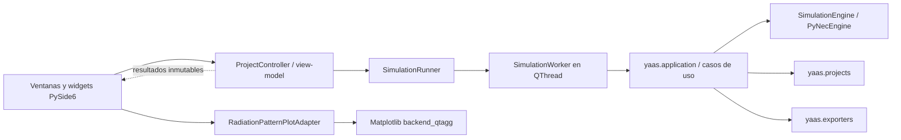

# Investigación: arquitectura inicial de la GUI y visualización 2D de patrones

- Fecha de la investigación: 2026-09-30
- Rama: `research/gui-radiation-visualization`
- Alcance: investigación y documentación únicamente. No se modificó
  código, pruebas, ejemplos, scripts, dependencias, versión ni
  documentación viva. Los prototipos se ejecutaron en un entorno
  virtual temporal fuera del repositorio (`%TEMP%\yaas-gui-proto\`,
  eliminado al terminar), sin tocar el `.venv` del proyecto ni
  `pyproject.toml`.
- Entorno: Windows 11 AMD64, Python 3.13.15, PySide6 6.11.2 (Qt
  6.11.2), Matplotlib 3.11.2, pyqtgraph 0.14.0, PyInstaller 6.22.3.
  Se instaló el **metapaquete** `PySide6==6.11.2` (que arrastra
  `PySide6-Essentials` y `PySide6-Addons`); no se probó una
  instalación con `PySide6-Essentials` solo.
  Linux no se ejecutó en esta investigación: lo que se afirma sobre
  Ubuntu proviene de la metadata oficial de los paquetes (sección 2).

## 0. Resumen ejecutivo

La hipótesis de partida se **acepta con correcciones** que salieron de
los experimentos. Recomendación, en síntesis (detalle en la sección
14):

- **PySide6 + Matplotlib**, detrás de un **adaptador gráfico propio**
  (`RadiationPatternPlotAdapter`) que permita reemplazar Matplotlib.
- **Gráfico polar para el corte de azimut.** Para el corte vertical,
  la primera representación recomendada es un **gráfico cartesiano
  `theta` frente a dBi** (sección 6).
- **`QThread` + worker `QObject`** como primera implementación, detrás
  de `SimulationRunner`; un **proceso separado** queda como
  alternativa preparada en el diseño, no implementada.
- **Modo `offscreen`** de Qt para las pruebas y la CI.
- **Dependencias en un extra opcional** (`gui`); la CLI se sigue
  instalando sin Qt ni Matplotlib.
- **Patrón 3D postergado.**

Hallazgos que corrigen la hipótesis:

- **GIL.** En los experimentos realizados con PyNEC 2.3.4 sobre
  Windows y CPython 3.13, las llamadas nativas ensayadas retuvieron el
  GIL durante la mayor parte de su ejecución (un hilo Python puro
  avanzó al 13-16 % de su ritmo normal). No se verificó inspeccionando
  el código nativo, no se midió en Linux y no debe generalizarse a
  otras funciones o versiones de PyNEC. Consecuencia observada: un
  `QThread` no garantiza fluidez total; un patrón de 91×361 sobre
  tierra real pausó la interfaz ~490 ms en el prototipo (una medición,
  no una cota máxima).
- **Piso radial.** En Matplotlib, una ganancia por debajo del límite
  radial inferior se convierte en NaN y desaparece como un hueco,
  indistinguible de un nulo de NEC. El adaptador debe recortar esas
  ganancias al piso solo para dibujarlas, conservando su condición de
  dato válido (sección 6).
- **Alternativas descartadas para el polar.** pyqtgraph 0.14 no tiene
  gráfico polar y su exportación SVG falló con PySide6 6.11.2 en todos
  los casos probados; queda para gráficos cartesianos muy interactivos,
  a reevaluar. Qt Charts (`QPolarChart`) está obsoleto y usa la
  orientación de una brújula.

Ninguna dependencia nueva se agrega hasta cumplir la condición de la
sección 14.

## 1. Contexto del proyecto relevante para la GUI

- Python `>=3.13,<3.14`; Windows y Linux; ejecutable con PyInstaller
  (`scripts/build_windows.ps1`, `scripts/build_linux.sh`); licencia
  GPL-3.0-only; hoy no se publica ningún ejecutable (ver
  [`docs/packaging/windows-release-compliance.md`](../packaging/windows-release-compliance.md)).
- El dominio, los proyectos, los exportadores y el motor ya son
  independientes de la presentación, y la CLI los orquesta sin tocar
  PyNEC directamente (`src/yaas/cli/main.py`). La GUI debe reutilizar
  exactamente las mismas APIs (`AGENTS.md`, "Future GUI").
- Patrones: `RadiationPatternResult.gain_db[theta][phi]` con forma
  `(n_theta, n_phi)`, `None` como nulo explícito, y
  `samples` en orden theta externo / phi interno
  ([fase 8](../phases/phase-8-radiation-patterns.md)).
- Convención angular validada contra 4nec2: `theta` desde +Z; `phi=0`
  es +X, `phi=90` es +Y, antihorario visto desde +Z
  ([validación](../validation/radiation-patterns-4nec2.md)).
- Con tierra, `theta <= 90`
  ([investigación](../research/nec-radiation-patterns.md)).
- Tierra real es lenta: ~42 ms por frecuencia en barridos y un contexto
  NEC2++ nuevo por frecuencia.

## 2. Fuentes consultadas

Todas consultadas el **2026-09-30**. Solo fuentes primarias (PyPI
oficial, documentación oficial de cada proyecto, paquetes oficiales de
Ubuntu); los resúmenes automáticos de páginas web se contrastaron con
experimentos cuando fue posible (ver la nota de la fila 12).

Las versiones son una foto de esa fecha, no restricciones permanentes:
la tarea que adopte la GUI debe volver a consultarlas. Los tags de los
wheels (`abi3`, `manylinux_2_34`, `cp313`) expresan una
**compatibilidad declarada** por cada proyecto; la disponibilidad
práctica en Ubuntu 22.04 y 24.04 (bibliotecas de sistema de Qt, plugin
de plataforma, ejecutable congelado) **no se probó** y queda pendiente.

| # | URL | Versión verificada | Afirmación respaldada |
|---|---|---|---|
| 1 | <https://pypi.org/pypi/PySide6/json> (y `PySide6-Essentials`, `PySide6-Addons`, `shiboken6`) | 6.11.2 (2026-08-18) | `Requires-Python >=3.10,<3.15`; licencia `LGPL-3.0-only OR GPL-2.0-only OR GPL-3.0-only`; wheels `abi3` para `win_amd64` y `manylinux_2_34_x86_64`; `PySide6` es un metapaquete de `PySide6-Essentials` (76.9 MB en Windows, 80.1 MB en Linux) y `PySide6-Addons` (168.2 MB en Windows). |
| 2 | <https://pypi.org/pypi/matplotlib/json> | 3.11.2 (2026-09-11) | `Requires-Python >=3.11`; wheels `cp313` para `win_amd64` (9.3 MB) y `manylinux_2_17_x86_64` (9.9 MB); dependencias `contourpy`, `cycler`, `fonttools`, `kiwisolver`, `numpy`, `packaging`, `pillow`, `pyparsing`, `python-dateutil`. |
| 3 | <https://pypi.org/pypi/pyqtgraph/json> | 0.14.0 (2025-11-16) | Licencia MIT; wheel `py3-none-any` (1.9 MB); dependencias `numpy` y `colorama`. |
| 4 | <https://pypi.org/pypi/pyinstaller/json> | 6.22.3 (2026-09-12) | GPLv2-or-later con excepción especial para el bootloader; `Requires-Python >=3.8,<3.16`. |
| 5 | <https://pypi.org/pypi/pyinstaller-hooks-contrib/json> | 2026.8 | Clasificadores Apache y GPLv2. |
| 6 | <https://pypi.org/pypi/pytest-qt/json> | 4.5.0 | Licencia MIT; `Requires-Python >=3.9`. |
| 7 | <https://pypi.org/pypi/pyvista/json> | 0.49.0 | Licencia MIT; depende de `vtk>=9.3.1,<9.8.0` y de Matplotlib. |
| 8 | <https://pypi.org/pypi/PyNEC/2.3.4/json> | 2.3.4 | Wheels solo para Linux y macOS; en Windows se compila desde el sdist. |
| 9 | <https://packages.ubuntu.com/jammy/libc6>, <https://packages.ubuntu.com/noble/libc6> | 2.35 / 2.39 | Ubuntu 22.04 y 24.04 superan el mínimo de glibc declarado por los wheels `manylinux_2_34` de PySide6. Cumplir ese mínimo no garantiza por sí solo que la GUI (ni su ejecutable congelado) funcione en esas versiones. |
| 10 | <https://doc.qt.io/qt-6/licensing.html> | Qt 6.11 | Módulos solo GPLv3 en la edición de código abierto (entre ellos Qt Graphs); Qt Core, Qt Gui y Qt Widgets no figuran en esa lista. |
| 11 | <https://doc.qt.io/qt-6/qtcharts-index.html>, <https://doc.qt.io/qt-6/qtgraphs-index.html>, <https://doc.qt.io/qt-6/qpolarchart-qtcharts.html> | Qt 6.11 | Qt Charts: GPLv3 o comercial, obsoleto desde Qt 6.10 en favor de Qt Graphs; `QPolarChart` "deprecated"; Qt Graphs: GPLv3 o comercial, tipos 2D sin gráfico polar en su índice. |
| 12 | <https://matplotlib.org/stable/api/projections/polar.html> | 3.11 | `set_theta_zero_location`, `set_theta_direction`, `set_rlim` (admite límites negativos), `set_thetamin`/`set_thetamax` (sectores). Nota: el resumen automático de esta página describía mal el sentido de `set_theta_direction`; el sentido se verificó experimentalmente (sección 4). |
| 13 | <https://matplotlib.org/stable/gallery/user_interfaces/embedding_in_qt_sgskip.html> | 3.11 | Integración mediante `matplotlib.backends.backend_qtagg`; funciona con PySide6; selección de binding con `QT_API`. |
| 14 | <https://matplotlib.org/stable/project/license.html> | 3.11 | Licencia basada en PSF, compatible con BSD; exige conservar el aviso de copyright; las fuentes incluidas (DejaVu, STIX, etc.) tienen licencias propias. |
| 15 | <https://pyqtgraph.readthedocs.io/en/latest/api_reference/graphicsItems/plotdataitem.html> | 0.14 / latest | `connect='finite'`: los valores no finitos producen un hueco; sin opción polar. |
| 16 | <https://doc.qt.io/qt-6/qthread.html> | Qt 6.11 | `terminate()`: "This function is dangerous and its use is discouraged"; `requestInterruption()` es "advisory"; patrón de worker con `moveToThread()`. |
| 17 | <https://doc.qt.io/qtforpython-6/PySide6/QtCore/QThreadPool.html> | 6.11 | `QRunnable` no es un `QObject`; no se interrumpe una tarea ya iniciada. |
| 18 | <https://doc.qt.io/qt-6/qguiapplication.html> | Qt 6.11 | Opción `-platform` y variable `QT_QPA_PLATFORM`; plugins `offscreen` y `minimal` para entornos sin GUI. |
| 19 | <https://pyinstaller.org/en/stable/hooks-config.html> | 6.22 | Desde PyInstaller 6.5 se prohíben varios bindings Qt en una misma aplicación; el hook de Matplotlib elige el binding (hooks ya ejecutados, luego `QT_API`) y permite limitar los backends recogidos. |
| 20 | <https://pyinstaller.org/en/stable/usage.html> | 6.22 | En modo `onefile`, las aplicaciones grandes pueden tener tiempos de extracción y arranque largos. |

## 3. Alternativas comparadas

### A. PySide6 + Matplotlib

- Integración: `FigureCanvasQTAgg` (`backend_qtagg`) es un widget Qt
  normal; con `QT_API=pyside6` Matplotlib usa PySide6.
- Polar: proyección polar nativa, con origen y sentido angulares
  configurables, límites radiales negativos y sectores
  (`set_thetamin`/`set_thetamax`) para medio círculo.
- Exportación: PNG, SVG y PDF con `Figure.savefig`, verificada.
- Interacción: barra de navegación estándar (zoom, desplazamiento,
  guardar); cursores y marcadores requieren código propio con eventos
  de Matplotlib. Suficiente para un corte polar; menos fluido que
  pyqtgraph para interacción intensa.
- Rendimiento medido: dibujo de 181 o 361 puntos en ~55 ms,
  actualización con un segundo resultado en 38-61 ms y 19 cortes de 37
  puntos en ~58 ms. Ampliamente suficiente para YAAS.
- Temas: `rcParams`/estilos propios de Matplotlib, independientes del
  tema Qt (hay que sincronizarlos a mano si se ofrece modo oscuro).
- PyInstaller: hook oficial; ejecutable mínimo `onefile` de 72.6 MB,
  que funcionó congelado en modo offscreen.
- Licencia: basada en PSF, permisiva; exige conservar el aviso, y las
  fuentes incluidas tienen licencias propias.
- Dependencias: nueve paquetes adicionales (Pillow, fontTools, etc.).

### B. PySide6 + pyqtgraph

- Integración: widgets Qt nativos (`PlotWidget`).
- Polar: **no hay soporte polar** en 0.14.0 (búsqueda en el código
  instalado: la palabra solo aparece en un nombre de mapa de colores).
  Hay que transformar a x/y, desplazar el radio para las ganancias
  negativas y dibujar a mano los anillos, radios y etiquetas.
- Interacción: zoom, desplazamiento y cursores de alto rendimiento,
  su punto fuerte.
- Rendimiento medido: actualización en 3-4 ms, diez veces más rápido
  que Matplotlib, pero ambos son suficientes para los tamaños de YAAS.
- Exportación: PNG correcto (`ImageExporter`); **`SVGExporter` falló**
  con PySide6 6.11.2 en todos los casos, incluido un gráfico
  cartesiano trivial (`ValueError` en `correctCoordinates`), con
  display real y offscreen. No se encontró un issue reportado ni se
  investigó la causa.
- PyInstaller: ejecutable mínimo de 77.3 MB (más que con Matplotlib).
- Licencia: MIT.

### C. Solo Qt/PySide6

- Qt Charts tiene `QPolarChart`, pero **el módulo está obsoleto desde Qt
  6.10** y la clase también; además, en el experimento `0°` quedó
  arriba y `90°` a la derecha (sentido horario, estilo brújula), lo
  opuesto a la convención de YAAS, así que habría que remapear ángulos.
  Qt Charts y Qt Graphs son GPLv3 en la edición abierta (compatible con
  YAAS, pero es una restricción adicional frente al LGPL del resto de
  Qt).
- Qt Graphs, su sucesor, no ofrece gráfico polar 2D en su índice.
- `QPainter`/`QGraphicsView` a mano: control total y sin dependencias
  nuevas, pero habría que implementar escalas, ticks, etiquetas,
  leyendas, exportación vectorial y accesibilidad. El costo es alto
  para el valor inicial.

### D. Trabajo futuro: patrón 3D

PyVista/VTK (MIT, depende de `vtk` y de Matplotlib) u otras opciones
quedan como investigación futura. No se recomienda ninguna ahora: el
3D agrega una dependencia nativa grande y no resuelve la primera
necesidad (cortes 2D).

## 4. Experimentos realizados

Todos fuera del repositorio, con datos sintéticos de un dipolo de media
onda sobre X (corte de azimut en `theta=90`, nulos como `None` en
`phi=0/180/360`, ganancias negativas presentes), salvo los de
concurrencia, que usaron el motor real de YAAS con PyNEC copiado en
modo de solo lectura desde el `.venv` del proyecto. Se ejecutaron con
el display real de Windows (plugin `windows`) y en
`QT_QPA_PLATFORM=offscreen`, con resultados idénticos. No se guardaron
capturas.

### 4.1 Gráficos (38 de 40 comprobaciones)

| Comprobación | Matplotlib | pyqtgraph |
|---|---|---|
| Ventana abre (display real y offscreen) | Sí | Sí |
| 181 y 361 puntos, 0 y 360 presentes | Sí | Sí |
| `phi=0` a la derecha, `phi=90` arriba, antihorario | Sí (`set_theta_zero_location("E")`, `get_theta_direction() == 1`) | Sí (transformación propia) |
| Escala radial en dBi con piso negativo | Sí (`set_rlim(-37, 3)`, radio monótono) | Sí, con desplazamiento manual |
| `None` produce un hueco | Sí (`None` -> NaN; 3 NaN, 2 tramos) | Sí (`connect='finite'`) |
| Ganancia bajo el piso radial | **Se vuelve NaN y desaparece** | Depende del recorte propio |
| Exportación | PNG, SVG, PDF | PNG; **SVG falla** |
| Actualización con un segundo resultado | 38-61 ms | 3-4 ms |
| 19 cortes de 37 puntos | ~58 ms | No medido |

Qt Charts (`QPolarChart`), solo orientación: `0°` arriba y `90°` a la
derecha (horario).

### 4.2 Concurrencia con el motor real

| Experimento | Resultado |
|---|---|
| ¿Las llamadas ensayadas liberan el GIL? | En estas mediciones, no durante la mayor parte de la ejecución: un hilo Python puro avanzó al 13-16 % de su ritmo durante una llamada nativa de ~0.57 s (`simulate_radiation_pattern` sobre tierra real, 91×361). |
| `QThread`: barrido de tierra real, 81 puntos (3.4 s) | Pausa máxima medida de la UI 55-60 ms (una llamada nativa por punto). |
| `QThread`: un patrón 91×361 sobre tierra real (0.49 s, una llamada) | **Pausa medida de la UI ~490 ms**, casi toda la llamada. |
| Proceso separado (`multiprocessing`, `spawn`) | Pausa máxima 21-26 ms; 0.92 s en total, incluido ~0.4 s de arranque. |
| Entrega del resultado | Llega al hilo principal solo si el receptor es un `QObject` que vive en él (conexión encolada). Conectar la señal a una función suelta la ejecutó en el hilo del worker. |
| Cancelación cooperativa | Funciona entre llamadas nativas (se detuvo tras 2 de 5 puntos); no puede interrumpir una llamada en curso. |
| Excepción en el worker | Llegó a la UI como señal con el traceback, sin romper la aplicación. |
| `QtConcurrent` en PySide6 | Sin `run()` para callables de Python: no aplicable. |
| `pickle` de `AntennaProject`, `RadiationPatternRequest`, `RadiationPatternResult` | Ida y vuelta exacta (571-3768 bytes). Es una condición necesaria para un proceso separado, no una solución: el resto del diseño queda pendiente (sección 8). |

Alcance de estas mediciones: PyNEC 2.3.4, Windows 11, CPython 3.13.15,
las llamadas y los modelos de la tabla (el dipolo del ejemplo
`dipole-20m-real-ground.yaas`), con un temporizador de interfaz de
10 ms. No se inspeccionó el código nativo de PyNEC, no se midió en
Linux y los resultados no deben generalizarse a otras funciones,
tamaños o versiones. Las pausas son mediciones de este prototipo, no
cotas máximas.

### 4.3 Empaquetado

| Ejecutable `onefile` (Windows) | Tamaño |
|---|---|
| `yaas.exe` actual (sin Qt) | 20.5 MB |
| PySide6 + Matplotlib mínimo | 72.6 MB |
| PySide6 + pyqtgraph mínimo | 77.3 MB |

Ambos arrancaron congelados en offscreen y exportaron un PNG. No se
midió Linux.

## 5. Criterios de decisión

| Criterio | PySide6 + Matplotlib | PySide6 + pyqtgraph | Solo Qt |
|---|---|---|---|
| Python 3.13 | Sí (wheels cp313) | Sí (py3) | Sí (abi3) |
| Windows | Sí (verificado) | Sí (verificado) | Sí |
| Ubuntu 22.04/24.04 | Wheels disponibles; no ejecutado | Wheels disponibles; no ejecutado | Wheels disponibles |
| Licencia compatible con GPL-3.0-only | Sí (PSF, permisiva) | Sí (MIT) | Sí; Charts/Graphs son GPLv3 |
| Integración PySide6 | Oficial (`backend_qtagg`) | Nativa | Nativa |
| Gráfico polar | Nativo, orientación configurable | No existe; manual | Obsoleto (Charts) o manual |
| Interacción | Básica (barra de navegación) | Excelente | Manual |
| Exportación | PNG/SVG/PDF | PNG; SVG falló | Manual |
| Tratamiento de `None` | NaN = hueco | `connect='finite'` | Manual |
| Rendimiento para YAAS | Suficiente (~55 ms) | Sobrado (~3 ms) | Suficiente |
| Facilidad de pruebas | Transformaciones consultables sin píxeles | Mapeo de escena consultable | Manual |
| PyInstaller | Hook oficial; 72.6 MB | 77.3 MB | Sin dependencias extra |
| Impacto de dependencias | +9 paquetes | +2 paquetes | Ninguno |
| Mantenibilidad | Alta: biblioteca estándar y documentada | Media: polar propio | Baja: todo propio |
| Riesgo técnico | Bajo | Medio (polar propio, SVG) | Alto (obsolescencia o esfuerzo) |

La diferencia de rendimiento no decide: ambos son suficientes para
cortes de cientos de puntos y grillas de miles.

## 6. Convención visual propuesta

### Corte de azimut (`theta` fijo): gráfico polar

La configuración se fija de forma explícita, sin depender de los
valores por defecto de Matplotlib:

```python
ax = figure.add_subplot(projection="polar")
ax.set_theta_zero_location("E")   # phi=0 hacia la derecha (+X)
ax.set_theta_direction(1)         # phi crece en sentido antihorario
ax.plot(np.radians(phi_deg), gains_for_plot)   # grados -> radianes
```

- Ambos métodos existen en la API polar documentada (fuente 12), y su
  efecto se verificó en el prototipo transformando puntos conocidos con
  `ax.transData`: `phi=0` quedó a la derecha del centro, `phi=90`
  arriba (+Y) y `phi=180` a la izquierda, con `get_theta_direction() ==
  1`. El sentido no se tomó de un resumen de la documentación, que lo
  describía al revés.
- Los ángulos del resultado están en grados y se convierten a radianes
  solo al dibujar (`np.radians`), en el adaptador.
- `phi=0` y `phi=360` son la misma dirección. El adaptador dibuja las
  muestras en el orden del resultado, sin agregar ni quitar ninguna:
  si el resultado incluye 0 y 360, el tramo 359-360 cierra la curva
  sobre la misma dirección, sin un segmento extra. El prototipo usó
  cortes con 0 y 360 (ambos nulos en el dipolo); no se probó un corte
  sin la muestra 360, que quedaría abierto y no debe cerrarse
  inventando un tramo.
- Etiquetas angulares en grados, sin nombres geográficos (los ejes son
  cartesianos +X/+Y, no Norte/Sur).

### Corte vertical (`phi` fijo): decisión provisional

`theta` es el ángulo **desde el cenit** (+Z), no una elevación: se
rotula siempre `theta`, nunca "elevación".

**Recomendación provisional para la primera GUI: un gráfico cartesiano
`theta` (eje horizontal, grados) frente a ganancia (eje vertical,
dBi).**

- Muestra exactamente los datos calculados: `theta` 0..180 en espacio
  libre y 0..90 con tierra, sin inventar datos bajo tierra ni reflejar
  ningún semiplano.
- Evita decidir ahora cómo proyectar `theta` en un polar sin evidencia
  de qué resulta más claro para los usuarios.
- Los nulos y el piso siguen las mismas reglas que el polar (abajo).
- Se prueba igual de fácil que el polar, sin comparar píxeles.

Alternativa para una etapa posterior, no para la primera versión: un
polar vertical con `theta=0` arriba y crecimiento horario
(`set_theta_zero_location("N")`, `set_theta_direction(-1)`, no
verificado en el prototipo), como semicírculo (espacio libre, 0..180)
o cuadrante (con tierra, 0..90). Reglas si se adopta:

- nunca reflejar automáticamente los datos para completar un círculo;
- si alguna vez se ofrece una duplicación reflejada, debe ser una
  opción explícita y rotulada como tal, distinta de los datos
  calculados;
- con tierra, nunca dibujar nada bajo el horizonte.

El plano vertical completo (`phi` y `phi+180`) necesita dos cortes o
una grilla con dos valores de `phi` y queda como pregunta abierta
(sección 15).

### Escala radial

- Radio (o eje vertical, en el corte cartesiano) en dBi, rotulado
  "Gain (dBi)" / "Ganancia (dBi)".
- Escala automática: tope en el entero superior al máximo finito y
  piso a un rango dinámico fijo por debajo (el prototipo usó 40 dB).
  Escala manual como opción futura.
- **Ganancias negativas**: el centro del polar es el piso de la escala,
  no 0 dBi; las ganancias negativas dentro del rango se dibujan
  normalmente.

### Nulos, piso visual y metadatos del adaptador

Tres casos que el adaptador distingue siempre:

| Caso | Qué es | Cómo se dibuja |
|---|---|---|
| `gain_db is None` | Nulo o valor no representable informado por NEC | Hueco en la curva: el adaptador lo convierte en NaN solo para dibujar |
| Ganancia finita dentro del rango | Dato válido | Su valor |
| Ganancia finita bajo el piso visual | **Dato válido**, fuera de la escala elegida | Recortada al piso (en el centro del polar), sin convertirse en NaN |

- NaN existe **solo dentro del adaptador** para producir la
  discontinuidad; nunca se convierte un `None` en -999.99 ni en el
  piso.
- El recorte es solo de representación: el adaptador no modifica
  `RadiationPatternResult` y nunca confunde un valor recortado con un
  nulo. Recortar hace falta porque Matplotlib convierte en NaN un valor
  bajo el límite radial (verificado), lo que lo haría desaparecer como
  si fuera un nulo.
- Junto con el dibujo, el adaptador devuelve metadatos para la
  interfaz: cantidad de nulos, cantidad de valores recortados y piso
  utilizado.
- Tooltips, resumen y exportaciones usan siempre el valor real: el CSV
  y el NEC se generan desde el resultado original con los exportadores
  existentes, nunca desde los datos recortados del gráfico.
- Cambiar el piso vuelve a dibujar desde el resultado original, no
  desde el dibujo anterior.

### Máximo, unidades y dirección

- Marcador en la dirección del máximo, con la misma regla que la CLI
  (primera muestra theta-major con tolerancia de 1e-9 dB): se reutiliza
  la función, no se reimplementa.
- Las etiquetas muestran direcciones físicas (`theta=… deg, phi=…
  deg`), nunca índices de la matriz; el adaptador recibe ángulos, no
  posiciones de `gain_db`.

## 7. Arquitectura propuesta



| Capa | Responsabilidad | Puede importar | No puede |
|---|---|---|---|
| Dominio (`yaas.domain`) | Modelos y reglas, sin cambios | Solo el propio dominio | Qt, PyNEC, Matplotlib |
| Aplicación (`yaas.application`) | Casos de uso compartidos con la CLI: cargar/guardar proyecto, calcular patrón, exportar CSV/NEC | Dominio, proyectos, protocolo `SimulationEngine`, exportadores | Qt, argparse, un motor concreto |
| `ProjectController` (view-model) | Estado del documento (ruta, proyecto, modificado), resultados actuales, validación | Aplicación, dominio | Widgets, PyNEC |
| `SimulationRunner` | Ejecutar trabajos fuera del hilo de interfaz; una sola simulación a la vez | Qt Core, aplicación | Widgets |
| Widgets | Presentación y entrada del usuario | Controlador, adaptador de gráficos | Motor, exportadores o proyectos directamente |
| `RadiationPatternPlotAdapter` | Traducir un `RadiationPatternResult` al gráfico | Dominio, Matplotlib | Motor, PyNEC |

La GUI **nunca**: importa `nec_context`, manipula arrays de PyNEC, arma
tarjetas NEC, lee el JSON a mano ni ejecuta una simulación en el hilo
principal.

Interfaces mínimas (propuesta, sin implementar):

```python
class ProjectController(QObject):
    project_changed = Signal(object)      # AntennaProject | None
    pattern_ready = Signal(object)        # RadiationPatternResult
    busy_changed = Signal(bool)
    error = Signal(str)

    def open_project(self, path: Path) -> None: ...
    def save_project(self, path: Path | None = None) -> None: ...
    def calculate_pattern(self) -> None: ...   # rechaza si ya hay un trabajo
    def export_pattern_csv(self, path: Path) -> None: ...
    def export_pattern_nec(self, path: Path) -> None: ...


class SimulationRunner(QObject):
    """Ejecuta un trabajo inmutable fuera del hilo de la interfaz."""
    finished = Signal(object)
    failed = Signal(str)                  # mensaje + traceback
    def submit(self, job: Callable[[], object]) -> bool: ...  # False si ocupado
    def request_cancel(self) -> None: ...  # cooperativo, entre llamadas


@dataclass(frozen=True)
class PlotSummary:
    """Metadatos del dibujo; el resultado original no se modifica."""
    null_count: int        # gain_db is None
    clipped_count: int     # finitos bajo el piso, dibujados en el piso
    floor_db: float        # piso visual utilizado


class RadiationPatternPlotAdapter:
    def __init__(self, parent: QWidget) -> None: ...
    def widget(self) -> QWidget: ...
    def show_azimuth_cut(self, result: RadiationPatternResult, *,
                         floor_db: float | None = None) -> PlotSummary: ...
    def show_vertical_cut(self, result: RadiationPatternResult, *,
                          floor_db: float | None = None) -> PlotSummary: ...
    def clear(self) -> None: ...
    def export_image(self, path: Path) -> Path: ...
```

Para no duplicar la orquestación de la CLI, el cálculo y las
exportaciones del patrón deberían moverse primero a un caso de uso en
`yaas.application` (por ejemplo, `calculate_project_pattern`) que usen
la CLI y la GUI por igual, del mismo modo que ya existe
`compare_project_measurement`. Hoy esa orquestación y la regla del
máximo viven en `src/yaas/cli/main.py`.

## 8. Concurrencia

| Opción | Ventajas | Costos |
|---|---|---|
| `QThread` + worker `QObject` (`moveToThread`) | El trabajo no corre en el slot de la interfaz; señales con resultado, error y progreso; conexiones encoladas al hilo principal; documentado por Qt | No garantiza fluidez total: en las mediciones, la interfaz se pausó durante cada llamada nativa que retuvo el GIL |
| `QThreadPool` + `QRunnable` | Liviano para muchas tareas cortas | `QRunnable` no es `QObject`: hace falta un objeto aparte para las señales; no aporta nada para un único trabajo |
| `QtConcurrent` | — | Sin `run()` para callables de Python en PySide6 |
| Proceso separado (`multiprocessing`/`QProcess`) | Interfaz fluida también durante llamadas nativas largas (pausa medida de 21-26 ms) | ~0.4 s de arranque por trabajo en el prototipo y un diseño completo pendiente (ver abajo) |

**Recomendación para la primera GUI:** `QThread` + un worker `QObject`,
detrás de `SimulationRunner`.

- `QThread` evita ejecutar el trabajo directamente desde el slot de la
  interfaz, pero **no garantiza fluidez total** mientras una extensión
  nativa conserva el GIL. Las pausas medidas fueron de 55-60 ms en un
  barrido de tierra real y de ~490 ms en un patrón de 91×361 sobre
  tierra real. La segunda ya es perceptible, aunque puede ser aceptable
  para el primer alcance, cuyas operaciones típicas (un patrón de 181
  puntos, un punto de barrido) duran decenas de milisegundos. Trabajos
  más largos podrían requerir un proceso separado.
- La ejecución queda oculta detrás de `SimulationRunner`, para poder
  reemplazar su implementación por un proceso separado sin tocar
  widgets ni controlador.
- **Condición para cambiar a un proceso separado** (cualquiera de estas,
  sin fijar ahora un umbral definitivo):
  - las pruebas de la GUI muestran pausas que se consideren
    perceptibles o inaceptables en operaciones reales;
  - una operación real supera un umbral de experiencia de usuario que
    se definirá al diseñar la GUI;
  - se incorpora un cálculo nativo de varios segundos sin puntos de
    cancelación intermedios.

Reglas del runner:

- un trabajo por vez, con los controles de cálculo deshabilitados
  mientras corre, para impedir simulaciones simultáneas incompatibles;
- cada trabajo recibe objetos inmutables y usa un contexto nuevo por
  solicitud (ya lo hace el motor);
- el resultado vuelve por señal a un `QObject` que vive en el hilo
  principal (conectarlo a una función suelta lo ejecutó en el hilo del
  worker);
- las excepciones vuelven como señal con su traceback.

### Cancelación

Cinco situaciones distintas, que la GUI debe tratar por separado:

1. **Cancelación solicitada:** el usuario pide cancelar; el runner
   registra la solicitud (una bandera o `requestInterruption()`, que Qt
   define como "advisory") y la interfaz muestra "cancelando".
2. **Cancelación cooperativa entre llamadas:** el trabajo revisa la
   solicitud entre llamadas nativas (por ejemplo, entre frecuencias de
   un barrido) y se detiene; funcionó en el prototipo.
3. **Llamada nativa en curso:** hoy **no hay forma segura de
   interrumpirla**; hay que esperar a que termine. No se usa
   `QThread.terminate()`, que Qt califica de peligrosa, ni se termina
   el intérprete.
4. **Resultado de un trabajo cancelado:** si la llamada en curso termina
   después de la cancelación, su resultado se descarta; no se muestra
   ni reemplaza el resultado vigente.
5. **Cierre de la aplicación con un worker activo:** pedir
   confirmación, solicitar la cancelación, deshabilitar nuevas
   acciones y esperar a que termine la llamada en curso antes de
   cerrar.

Con un proceso separado, terminar el proceso sería técnicamente
posible, pero no está resuelto: requiere diseñar su ciclo de vida, los
archivos temporales, la serialización de solicitudes y resultados, la
propagación de errores y tracebacks, la limpieza tras una terminación y
el comportamiento en PyInstaller y Windows (`spawn`,
`freeze_support()`). Que `pickle` funcione con los modelos del dominio
es solo una condición necesaria.

## 9. Primera versión de las pantallas

```text
+--------------------------------------------------------------+
| Archivo: Nuevo | Abrir | Guardar | Guardar como    Idioma    |
+---------------+----------------------------------------------+
| Proyecto      | [Geometría] [Simulación] [Barrido] [Patrón]  |
|  nombre       | [Registro]                                   |
|  esquema v4   |                                              |
|  entorno      |  Pestaña Patrón:                             |
|  frecuencia   |  theta: inicio [0] cantidad [181] paso [1]   |
|               |  phi:   inicio [0] cantidad [1]   paso [0]   |
|               |  [Calcular]  [Cancelar]  estado/progreso     |
|               |  +------------------+  Grilla: 181 x 1       |
|               |  |  gráfico (*)     |  Válidos: 180 Nulos: 1 |
|               |  |                  |  Máx: 2.12 dBi         |
|               |  +------------------+  theta=0 phi=0         |
|               |  [Exportar CSV] [Exportar NEC] [Imagen]      |
+---------------+----------------------------------------------+
```

- (*) Polar para un corte de azimut; `theta` frente a dBi para un
  corte vertical (sección 6). El resumen muestra también la cantidad
  de valores recortados y el piso utilizado.
- Geometría, Simulación y Barrido: primero solo lectura (datos del
  proyecto y resultados), sin editor.
- Patrón: la configuración se edita en la pestaña y se guarda en el
  proyecto v4; el cálculo usa el mismo caso de uso que la CLI.
- Registro: mensajes y errores, incluidos los tracebacks del worker.
- Sin editor 3D.

## 10. Estrategia incremental

| Etapa | Alcance | Prueba mínima | Riesgo | Aceptación |
|---|---|---|---|---|
| A | Esqueleto PySide6, abrir y guardar proyecto | Controlador sin widgets; ventana en offscreen | Bajo | Abre los cuatro ejemplos y guarda en v4 sin cambios semánticos |
| B | Mostrar datos del proyecto y errores de validación | Controlador con proyectos válidos e inválidos | Bajo | Mensajes iguales a los de la CLI |
| C | Simulación puntual y barrido en `SimulationRunner` | Runner con un motor falso; motor real en integración | Medio (GIL, cierre durante cálculo) | UI con pausas acotadas; un trabajo por vez; errores visibles |
| D | Patrón 2D con el adaptador | Adaptador sin píxeles (sección 11) | Medio (contrato visual) | Orientación, nulos y piso verificados por transformaciones |
| E | Exportaciones CSV, NEC e imagen | Reutilizan los exportadores existentes | Bajo | Archivos idénticos a los de la CLI |
| F | Preferencias e idioma | Cambio de idioma sin reiniciar o documentado | Bajo | Español e inglés completos |
| G | Empaquetado | Smoke test del ejecutable GUI en offscreen | Medio (tamaño, plugins Qt) | Ejecutable arranca, abre un proyecto y exporta una imagen |
| H | Evaluación 3D | Investigación aparte | Alto | Decisión documentada |

## 11. Estrategia de pruebas

- **Controlador y runner sin GUI real:** pruebas unitarias con un motor
  falso (como `_FakeEngine` de las pruebas de comparación) y señales
  capturadas; sin ventanas.
- **Widgets:** `pytest-qt` (MIT, 4.5.0) es la opción natural para
  `qtbot` y esperar señales; se evaluará al empezar la etapa A, sin
  agregarlo todavía.
- **CI:** `QT_QPA_PLATFORM=offscreen`, que funcionó para todos los
  experimentos de esta investigación.
- **Adaptador de gráficos, sin comparar píxeles:**
  - orientación: transformar puntos conocidos con `ax.transData` y
    comprobar que `phi=0` queda a la derecha del centro y `phi=90`
    arriba (así se verificó aquí);
  - nulos: contar los tramos de la trayectoria (`MOVETO`) con NaN;
  - piso: comprobar que ningún valor finito se pierde como NaN, que
    `PlotSummary` informa la cantidad correcta de nulos y de valores
    recortados, y que el `RadiationPatternResult` (y por lo tanto el
    CSV) conserva los valores reales;
  - rotulado y máximo: leer los textos y el marcador del eje.
- **Evitar** capturas comparadas píxel a píxel: dependen de fuentes,
  antialiasing, DPI y versión de Matplotlib.
- **Ejecutable:** un smoke test que arranque la GUI en offscreen, abra
  el ejemplo de patrón y exporte una imagen, además de los smoke tests
  de CLI existentes.

## 12. Empaquetado y CI

- Wheels: PySide6 (`abi3`) y Matplotlib (`cp313`) declaran wheels para
  Windows y Linux x86-64; en Linux, los de PySide6 declaran glibc 2.34
  o posterior (Ubuntu 22.04 tiene 2.35). Es compatibilidad declarada:
  la instalación, la GUI y el ejecutable congelado en Ubuntu 22.04 y
  24.04 quedan pendientes de prueba real.
- Solo debe instalarse **un** binding Qt: PyInstaller 6.5+ aborta si se
  ejecutan hooks de más de uno. Conviene fijar `QT_API=pyside6` y, si
  hace falta, excluir los demás con `--exclude-module`.
- Matplotlib: el hook permite limitar los backends recogidos; YAAS solo
  necesita `QtAgg` (y el backend sin pantalla para exportar).
- Plugins Qt: el hook de PySide6 recoge los plugins de plataforma; el
  ejecutable mínimo funcionó con `offscreen`. En Linux, además, harán
  falta bibliotecas del sistema de X11/Wayland en el runner; no se
  verificó en esta investigación.
- Tamaño: el ejecutable pasaría de ~20 MB a ~73 MB o más en Windows
  (medido con el metapaquete PySide6 instalado; el hook solo recoge los
  módulos usados), y
  el arranque `onefile` será más lento. Conviene mantener un ejecutable
  de CLI separado y liviano y evaluar `onedir` para la GUI.
- CI: un job de GUI separado en el futuro (offscreen, Windows y
  Ubuntu), para no condicionar la suite actual a Qt.

## 13. Licencias

| Componente | Licencia | Tipo | ¿Incorporado al ejecutable? |
|---|---|---|---|
| PySide6 / Shiboken6 / Qt | LGPL-3.0-only o GPL-2.0-only o GPL-3.0-only (PyPI) | Runtime | Sí (bibliotecas Qt y plugins) |
| Qt Charts / Qt Graphs | GPLv3 o comercial (documentación de Qt) | Runtime, solo si se usan | Sí, si se usan |
| Matplotlib | Basada en PSF (permisiva); fuentes con licencias propias | Runtime | Sí, con sus fuentes |
| Dependencias de Matplotlib (Pillow, fontTools, contourpy, kiwisolver, …) | Varias | Runtime | Sí |
| pyqtgraph | MIT | Runtime (si se adopta) | Sí |
| PyInstaller | GPLv2+ con excepción del bootloader | Desarrollo | Solo el bootloader |
| pytest-qt | MIT | Desarrollo | No |
| PyVista / VTK | MIT / BSD | Futuro | — |

Hay que distinguir:

- **El binding PySide6/Shiboken6:** PyPI declara `LGPL-3.0-only OR
  GPL-2.0-only OR GPL-3.0-only`.
- **Los módulos Qt incorporados al ejecutable** (bibliotecas y
  plugins): los que figuran como solo GPLv3 en la documentación de Qt
  (por ejemplo, Qt Graphs) y Qt Charts no ofrecen la opción LGPL; Qt
  Core, Qt Gui y Qt Widgets no figuran en esa lista. La lista exacta de
  módulos incorporados debe relevarse al empaquetar.
- **Matplotlib:** licencia propia basada en PSF, permisiva, que exige
  conservar su aviso; sus fuentes incluidas y sus dependencias tienen
  licencias propias.
- **Obligación de avisos:** todos los componentes incorporados
  requieren sus avisos de copyright y textos de licencia.
- **Obligaciones potenciales al distribuir binarios:** código fuente
  correspondiente, posibilidad de reemplazar bibliotecas bajo LGPL y
  textos de licencia, además de lo que ya exige
  `docs/packaging/windows-release-compliance.md`.

YAAS es GPL-3.0-only, así que puede usar Qt bajo su opción GPL-3.0 o
LGPL-3.0. Elegir LGPL no elimina todas las obligaciones, y nada de esto
es una conclusión legal definitiva: debe revisarse junto con
`docs/decisions/0004-project-license.md` antes de distribuir binarios.

Al adoptar la GUI habrá que actualizar:

- `THIRD_PARTY_NOTICES.md`: PySide6/Shiboken6/Qt (con los módulos y
  plugins incluidos), Matplotlib, sus fuentes y cada dependencia
  runtime incorporada al ejecutable;
- `docs/packaging/windows-release-compliance.md` y la documentación de
  cumplimiento para Linux, con las obligaciones de Qt;
- el paquete de fuentes y licencias que acompañe a cualquier binario
  publicado.

## 14. Recomendación

- **Stack:** PySide6 + Matplotlib. Se descartan Qt Charts, por
  obsoleto, y pyqtgraph para el polar; pyqtgraph queda para gráficos
  cartesianos muy interactivos, reevaluando antes su exportación SVG.
- **Adaptador gráfico propio** (`RadiationPatternPlotAdapter`) como
  única frontera con Matplotlib, que devuelve los metadatos de dibujo
  (nulos, recortados, piso) sin modificar el resultado.
- **Representación:** polar para el corte de azimut; como primera
  representación vertical, evaluar un gráfico cartesiano `theta` frente
  a dBi.
- **Arquitectura:** la de la sección 7, con un caso de uso de
  aplicación compartido con la CLI.
- **Concurrencia:** `QThread` + worker `QObject` como primera
  implementación, detrás de `SimulationRunner`, un trabajo por vez y
  cancelación cooperativa entre llamadas. El proceso separado queda
  como alternativa preparada en el diseño, no implementada, con la
  condición de cambio de la sección 8.
- **Primera pantalla:** ventana principal con la pestaña Patrón de la
  sección 9.
- **Pruebas:** controlador y adaptador sin comparar píxeles, con Qt en
  modo `offscreen`.
- **Dependencias en un extra opcional** (nombre tentativo `gui`), sin
  modificar ahora `pyproject.toml`:
  - `PySide6` en la distribución que se pruebe en la tarea de adopción
    (el prototipo usó el metapaquete; si `PySide6-Essentials` alcanza
    es una pregunta abierta);
  - `matplotlib`;
  - `pytest-qt` solo como dependencia de desarrollo, si finalmente se
    adopta;
  - la CLI base debe seguir instalándose sin Qt ni Matplotlib.
- **Patrón 3D postergado.**
- **Riesgos:** pausas de la interfaz durante llamadas nativas largas;
  tamaño y arranque del ejecutable; dependencias de sistema de Qt en
  Linux; obligaciones de licencia de Qt al distribuir binarios.
- **Condición antes de agregar dependencias:** una tarea explícita que
  cree el extra `gui` sin afectar la CLI ni su ejecutable, con la
  revisión de licencias de la sección 13, la actualización de
  `THIRD_PARTY_NOTICES.md` y un job de CI en modo `offscreen`.

## 15. Preguntas abiertas

1. **2D antes que 3D:** se recomienda 2D primero; el 3D necesita su
   propia investigación.
2. **Theta en el corte vertical:** la primera versión propone
   `theta` frente a dBi (cartesiano); queda abierto si luego conviene
   un polar en semicírculo/cuadrante o un plano vertical completo
   combinando `phi` y `phi+180`.
3. **Escala radial:** rango dinámico por defecto (se probó 40 dB),
   escala manual y cómo mostrar los valores bajo el piso.
4. **Cancelación:** si hará falta un proceso separado para cancelar o
   evitar pausas con patrones grandes sobre tierra real, y el umbral
   de experiencia de usuario que lo decida.
5. **Editor geométrico futuro:** cómo integrarlo sin mezclar edición y
   visualización.
6. **Tamaño del ejecutable:** ejecutables separados de CLI y GUI, y
   `onefile` frente a `onedir`.
7. **Accesibilidad y temas:** contraste, tamaño de fuentes y modo
   oscuro, sincronizando Matplotlib con el tema de Qt.
8. **Distribución binaria y licencias:** obligaciones de Qt y de las
   dependencias de Matplotlib en una release con ejecutable.
9. **Exportación SVG de pyqtgraph:** si el fallo observado con PySide6
   6.11.2 está reportado o corregido.
10. **GIL en Linux y en otras llamadas:** repetir la medición en
    Ubuntu y con otras funciones y tamaños antes de generalizarla.
11. **Distribución de PySide6:** si `PySide6-Essentials` alcanza para
    la GUI, en vez del metapaquete `PySide6`.
